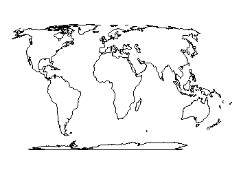
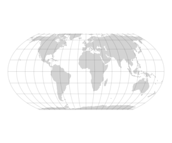
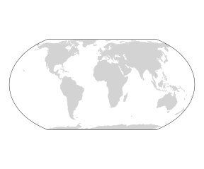

# Equal Earth 

The use of the Equal Earth projection in maps was recommended from the United Nations General Assembly on 4th of September. Equal Earth is a equal-area projection for world maps, and hence preserves the relative size of geographic areas. This step leads to a more fair representation of the world's continents, especially of countries close to the equator.

# Implement Equal Earth projection in R

To use the projection for maps in R, we just have to transform our sf-object to `"+proj=eqearth"`.

``` r
require(sf)
require(rnaturalearth)

sf_use_s2(FALSE)
sh_world <- rnaturalearth::ne_countries(type = "countries") |>
  sf::st_combine() |>
  sf::st_union(by_feature = T) |>
  sf::st_transform("+proj=eqearth")
```

{fig-align="center"}

We can already see, that for example Greenland looks way smaller than on the usual Mercator projection.

## Graticules

If we want now to display the distortion we can use the function `sf::st_graticule()` to create graticules.

```r
g <- sf::st_graticule() |>
    sf::st_transform("+proj=eqearth")
    
require(ggplot2)

ggplot2::ggplot() +
ggplot2::geom_sf(aes(geometry = sh_world), fill = "lightgrey", color = "lightgrey")+
ggplot2::geom_sf(aes(geometry = st_as_sfc(g)), alpha = 0.1) +
ggplot2::theme_void()
```
{fig-align="center"}

The distortion is now more clearly visible, but the inner lines do indeed make the image very cluttered. I wrote a function that keeps only the outer grid lines and closes them at the top and bottom. This allows the distortion to be visualized to some extent, and the inner lines are removed so that the actual content of the map becomes visible.

```r
create_outer_graticule <- function() {
  g <- sf::st_graticule() |>
    sf::st_transform("+proj=eqearth") |>
    dplyr::filter(degree == -180 | degree == 180) |>
    sf::st_cast("LINESTRING") |>
    sf::st_as_sfc()

  point1 <- sf::st_point(c(-180, 89.91))
  point2 <- sf::st_point(c(180, 89.91))
  line1 <- sf::st_combine(c(point1, point2)) |>
    sf::st_cast("LINESTRING") |>
    sf::st_set_crs("WGS84") |>
    sf::st_transform("+proj=eqearth")
    
  point4 <- sf::st_point(c(-180, -89.91))
  point3 <- sf::st_point(c(180, -89.91))
  line2 <- sf::st_combine(c(point3, point4)) |>
    sf::st_cast("LINESTRING") |>
    sf::st_set_crs("WGS84") |>
    sf::st_transform("+proj=eqearth")

  g_outer <- sf::st_combine(c(g[1], line1, g[2], line2)) |>
    st_polygonize()
  return(g_outer)
}

g_outer <- create_outer_graticule()

ggplot2::ggplot() +
ggplot2::geom_sf(aes(geometry = sh_world), fill = "lightgrey", color = "lightgrey")+
ggplot2::geom_sf(aes(geometry = g_outer), fill = NA) +
ggplot2::theme_void()
```

{fig-align="center"}

# A small step towards a fairer world? 

I think that the perception of countries is often related to how they are shown in maps. I hope to see future global maps only in equal-area projections, so the perception can actually change in the future. 

